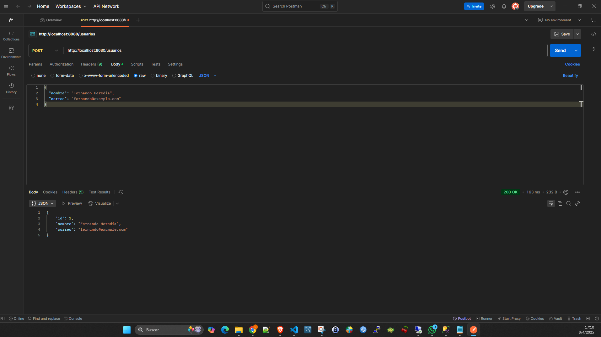
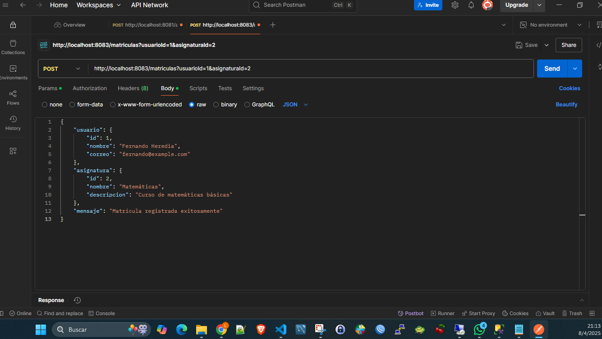
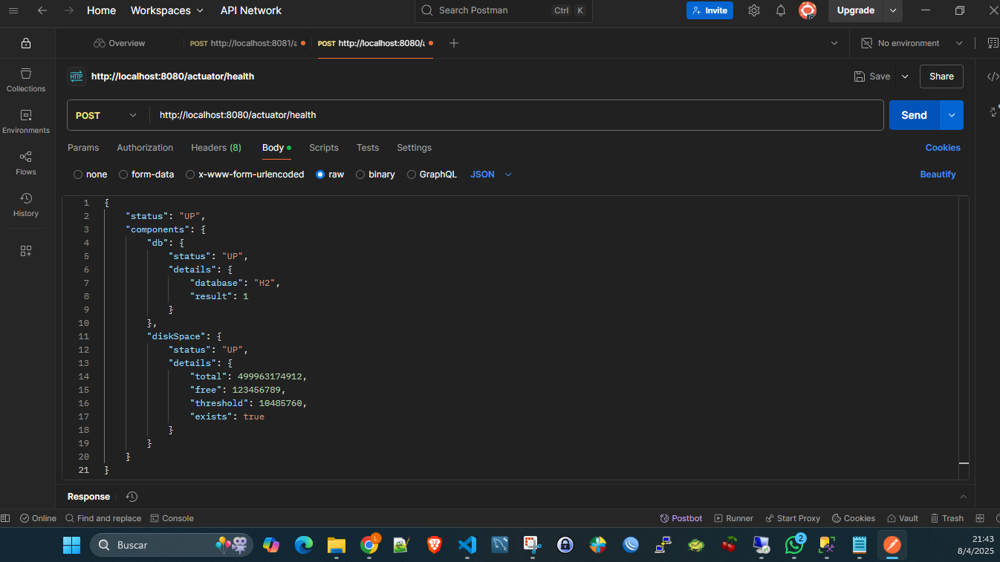

# sistema-educativo-microservicios-fernando-heredia
Parcial No 2
# Sistema Educativo - Microservicios

Este sistema educativo está desarrollado bajo una arquitectura de microservicios utilizando Spring Boot y Spring Cloud.

## Microservicios

- **usuarios-servicio**: Maneja el registro y gestión de estudiantes y docentes.
- **asignaturas-servicio**: CRUD de materias académicas.
- **matriculas-servicio**: Maneja la inscripción de estudiantes a materias.

Cada microservicio es independiente, con su propia base de datos, configuración y comunicación a través de Feign y Eureka.

## Objetivo

Aplicar los conceptos de microservicios, configuración distribuida, descubrimiento de servicios, seguridad con JWT, monitoreo, pruebas y despliegue con Docker.

## Datos del estudiante

- **Nombre:** Luis Fernando Heredia
- **Correo institucional:** luis.heredia.4774@miremington.edu.co
- **Curso:**  LENGUAJE DE PROGRAMACIÓN AVANZADO 2 - PARCIAL 2-MICROSERVICIOS

